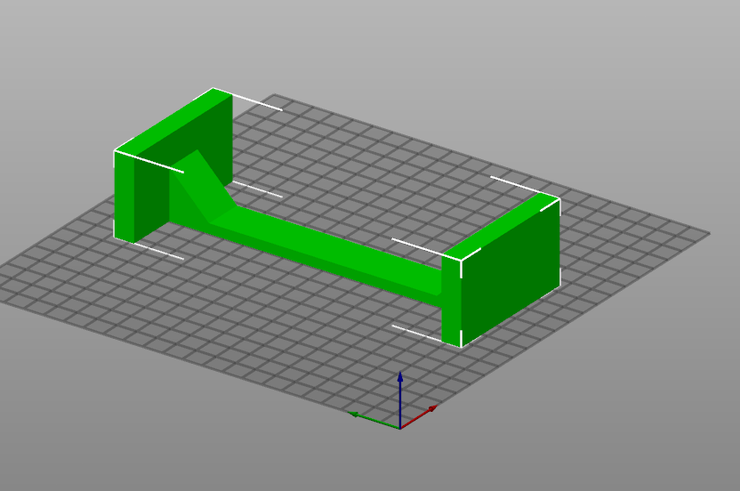

# Mining Cad adventures

## Simple motherboard support

Print two of them, 10% infill is enough

[STL File](https://github.com/rodrigoms2004/cad-mining/blob/main/STL/base_motherboard_simple.stl)

## Powersupply support

[STL File](https://github.com/rodrigoms2004/cad-mining/blob/main/STL/base_powersupply.stl)

